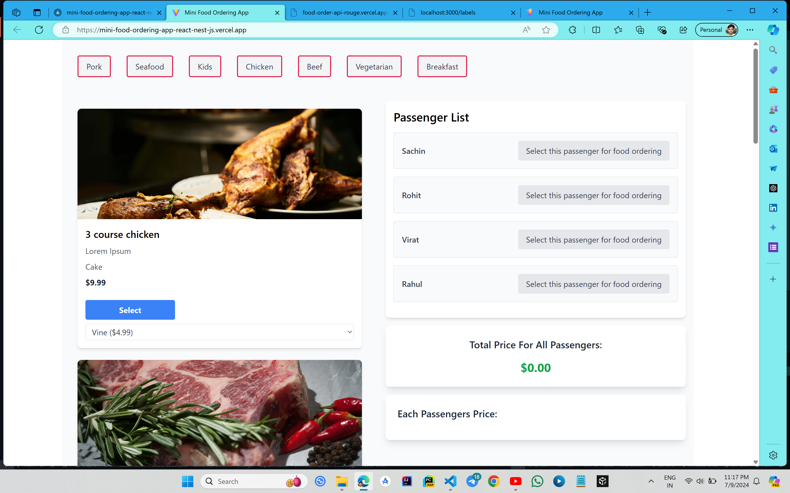

# Food Ordering App Using React JS and Nest JS


[](https://mini-food-ordering-app-react-nest-js.vercel.app/)
[](https://food-order-api-rouge.vercel.app/)

# To Run Locally
### 1. Clone the repository

        git clone https://github.com/skp3214/MiniFoodOrderingApp-React-NestJs.git

### 2. Now Run The Backend
- Nagigate to backend folder from terminal using below command
        
        cd backend
- Install the Nest Js Globally
  
        npm i -g @nestjs/cli@latest

- Now Install the dependencies
        
        npm i

- Run the backend using below command
     
        npm run start

- Click on the below url access api
   
        http://localhost:3000

    -  http://localhost:3000 will give all meals data.
    -  http://localhost:3000/labels will give  all labels data.
  

### 3. Now Run The Frontend
- Nagigate to frontend folder from terminal using below command
 
        cd frontend

- Install the dependencies
 
        npm i 

- Before running the project do some changes in `App.jsx` 
   
   ```js
   const fetchMeals = async () => {
    const response = await fetch(`${config.apiUrl}`||`http://localhost:3000`);
    const meals = await response.json();
    console.log(meals);
    setMeals(meals);
  };

  const fetchLabels = async () => {
    const response = await fetch(`${config.apiUrl}/labels`||'http://localhost:3000/labels');
    const labels = await response.json();
    console.log(labels);
    setLabels(labels);
  };
   ```
   replace above code with below code.
   Just copy and paste otherwise you may face problem with deployed api url.

   ```js
   const fetchMeals = async () => {
    const response = await fetch('http://localhost:3000');
    const meals = await response.json();
    console.log(meals);
    setMeals(meals);
  };

  const fetchLabels = async () => {
    const response = await fetch('http://localhost:3000/labels');
    const labels = await response.json();
    console.log(labels);
    setLabels(labels);
  };
   ```

- Now run the project

         npm run dev


## Tech Stack Used In Making This Project

### Front-End
- Vite+React
- Tailwind CSS
- React-Redux
  
### Backend
- Nest JS
- TypeScript

  

